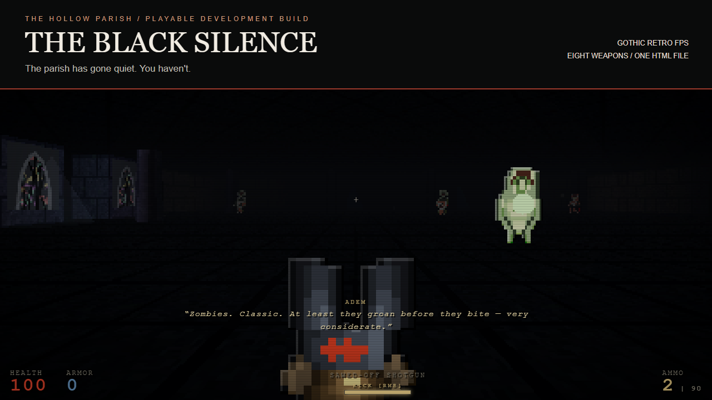
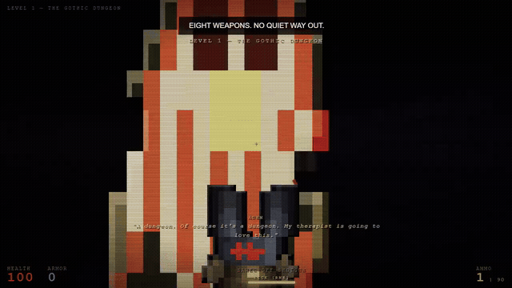

# THE BLACK SILENCE

### The Hollow Parish

**The parish has gone quiet. You haven't.**

A gothic retro first-person shooter with pixelated 3D spaces, eight weapons,
and a power kick for anything that gets too close. Download one HTML file,
open it in your desktop browser, and descend.



**[Play in your browser](https://torunum.github.io/black-silence/)** ·
**[Download the game](https://github.com/torunum/black-silence/releases/download/preview-2026-09-18/THE-BLACK-SILENCE.html)** ·
**[Watch the trailer](https://torunum.github.io/black-silence/media/black-silence-trailer.mp4)** ·
**[Press kit / Basın kiti](docs/PRESS-KIT.md)**

## Enter the Parish

- **A prologue and seven chapters:** from the pit and gothic dungeon through
  an abandoned church, necropolis, graveyard, sewers, factory, and The Womb.
- **Eight weapons to acquire:** a sawed-off shotgun, automatic weapons, a scoped
  sniper, the Holy Cross Launcher, and the Soul Reaper expand your arsenal.
- **Close-range impact:** sprint, jump, and power-kick enemies into walls.
- **More than corridors:** secret doors, red keys, explosive barrels, boss
  encounters, and a playable piano.
- **Built from code:** procedural textures, sprites, sound, and music;
  adjustable low-resolution rendering and locally saved chapter unlocks
  when browser storage is available.



[Dungeon screenshot](docs/media/dungeon.png) ·
[Church screenshot](docs/media/church.png)

## Play

Play directly on [GitHub Pages](https://torunum.github.io/black-silence/),
or download an offline copy:

1. [Download THE-BLACK-SILENCE.html](https://github.com/torunum/black-silence/releases/download/preview-2026-09-18/THE-BLACK-SILENCE.html).
2. Open the downloaded file in a desktop browser with WebGL enabled.
3. Choose **New Game** and click the game view to capture the mouse.

The standalone build includes Three.js and its generated game assets.
Once downloaded, it runs offline without a server or launcher.
Use a keyboard and mouse; touch controls are not implemented.

| Action | Control |
| --- | --- |
| Move / look | `W A S D` / mouse |
| Sprint / jump | `Shift` / `Space` |
| Fire / power kick | Left / right mouse button |
| Reload | `R` |
| Switch acquired weapons | `1`–`8` / mouse wheel |
| Open doors / interact / leave piano | `E` |
| Toggle sniper zoom | `Z` with the sniper equipped |

`Esc` releases the mouse; it does **not** pause the action.
Chapter unlocks and settings are saved locally, not mid-level progress.

## Development

This is a playable work in progress. Gameplay, balance, and presentation
still have known issues; see [project status](docs/STATUS.md) and
[known issues](docs/known-issues.md) for the development record.

The game is written in TypeScript with Three.js and Vite. Its tests include
behavior comparisons against the frozen original and scripted gameplay traces.
Use Node.js 24.15 or later within Node 24. The publication build passes 620 tests.

```sh
npm ci
npm run dev
```

Open the local URL printed by Vite. To check the project or regenerate the
standalone file:

```sh
npm test
npm run build:single
```

The standalone file has been smoke-tested offline. The build script checks
for leftover asset references in HTML attributes; this check alone is not
a complete network-dependency audit.

| Directory | Contents |
| --- | --- |
| `src/` | Game systems, procedural assets, and level definitions |
| `tests/` | Behavior checks and gameplay traces |
| `reference/` | Frozen original used for comparisons |
| `docs/` | Media, press kit, status, and design records |
| `scripts/` | Build and verification tools |

## Türkçe

**Sessizlik çöktü. Sıra sende.**

THE BLACK SILENCE: The Hollow Parish, gotik atmosferi retro FPS aksiyonuyla
birleştiren, geliştirme aşamasında oynanabilir bir oyun. Bir ön bölüm ve yedi
bölüm boyunca sekiz silahı keşfet; koş, zıpla ve yaklaşan düşmanları tekmeyle
savur. Gizli kapılar, bölüm sonu karşılaşmaları ve çalınabilir bir piyano seni
bekliyor.

[Tarayıcıda oyna](https://torunum.github.io/black-silence/) veya
[tek HTML dosyasını indir](https://github.com/torunum/black-silence/releases/download/preview-2026-09-18/THE-BLACK-SILENCE.html), masaüstü tarayıcında aç
ve klavye-fare ile oyna. İndirdikten sonra internet bağlantısı veya kurulum
gerektirmez. [Tanıtım videosu](https://torunum.github.io/black-silence/media/black-silence-trailer.mp4) ·
[Basın kiti](docs/PRESS-KIT.md)

## Credits

Created by [torunum](https://github.com/torunum). Rendering uses **Three.js**.
Game textures, sprites, sound, and music are generated by the code in this
repository.

See [Third-Party Notices](THIRD-PARTY-NOTICES.md) for the bundled rendering library.
No open-source license has been assigned to the original game code or artwork.
See [third-party notices](THIRD-PARTY-NOTICES.md) for dependency attribution.
