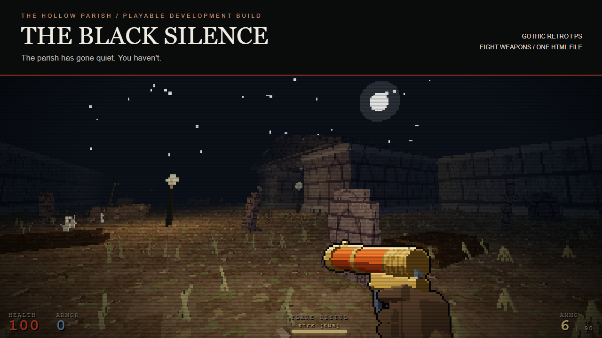
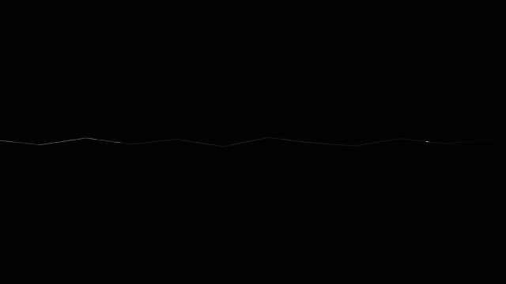
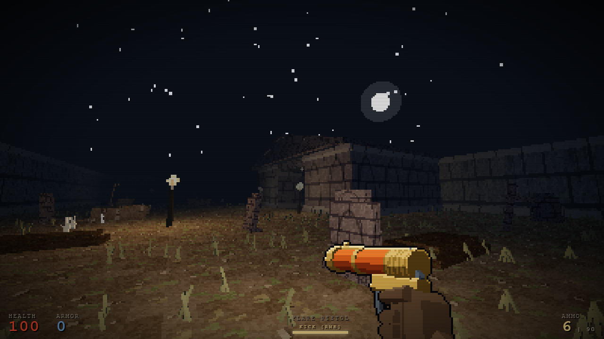
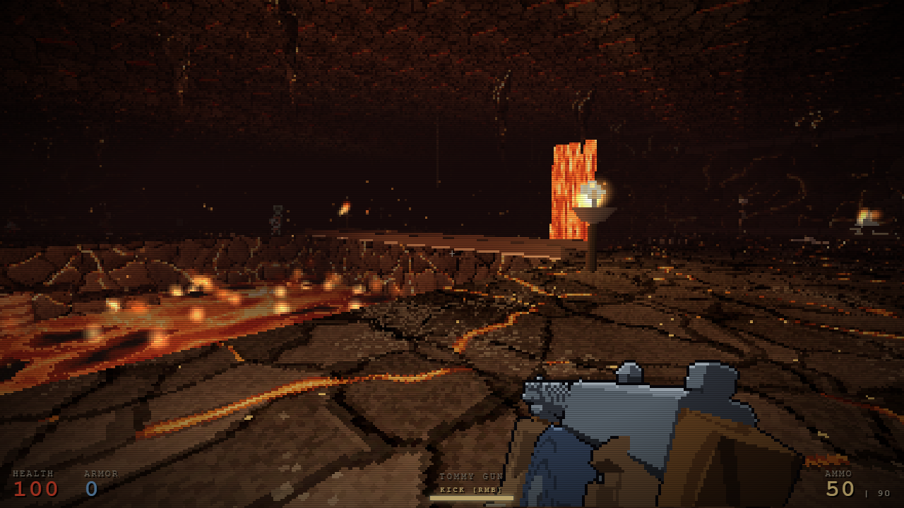
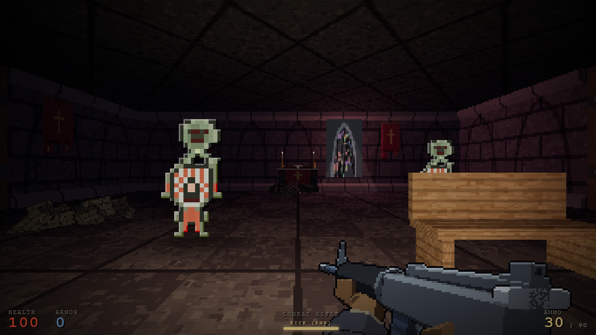
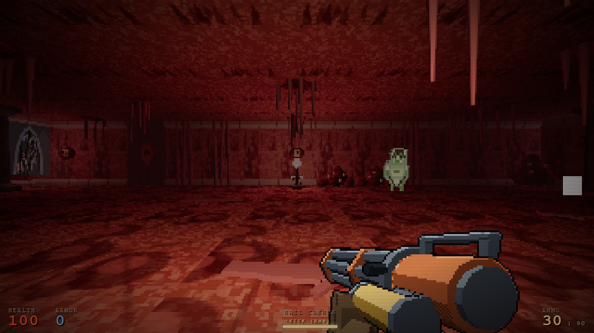
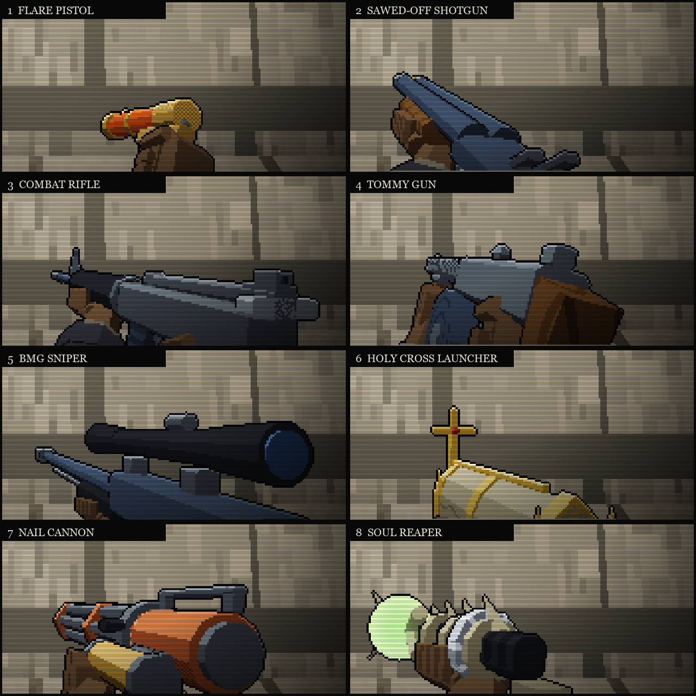

# THE BLACK SILENCE

### The Hollow Parish

**The parish has gone quiet. You haven't.**

A gothic retro first-person shooter with pixelated 3D spaces, eight weapons,
and a power kick for anything that gets too close. Download one HTML file,
open it in your desktop browser, and claw your way out of the ground.



**[Play in your browser](https://torunum.github.io/black-silence/)** ·
**[Download the game](https://github.com/torunum/black-silence/releases/download/preview-2026-09-18/THE-BLACK-SILENCE.html)** ·
**[Watch the trailer](https://torunum.github.io/black-silence/media/black-silence-trailer.mp4)** (from the 2026-09-18 build) ·
**[Listen to the sound board](https://torunum.github.io/black-silence/soundboard.html)** ·
**[Press kit / Basın kiti](docs/PRESS-KIT.md)**

## Enter the Parish

- **It starts in a grave.** In the prologue ADEM wakes in a coffin, splits the
  lid, and claws out into a churchyard at night: stars, a moon, headstones,
  a mausoleum. Its crypt stair leads down into hell: cracked basalt with
  glowing fissures, a real flowing lava pit with a lava fall, a stone bridge,
  fire and embers. Then you climb back out. Seven chapters follow: the gothic
  dungeon, an abandoned church, a necropolis, a graveyard, sewers, a factory,
  and The Womb.
- **Eight weapons to acquire:** a flare pistol, a sawed-off shotgun, a combat
  rifle, a tommy gun, a scoped sniper, the Holy Cross Launcher, a nail cannon,
  and the Soul Reaper. Each is a small 3D rig, posed and drawn down to pixel
  art every frame, with mechanisms that move: the pump, the break-open
  barrels, the drum, the spinning cluster.
- **Close-range impact:** sprint, jump, and power-kick enemies into walls.
  The sprint has its own pose, the stride is a human two or three steps a
  second, and the kick is a real leg.
- **Rooms with things in them:** a torture hall of cages, racks and iron
  maidens; a nave of candelabra, banners and fallen saints; sarcophagi, pipes
  and machines; flesh growths in The Womb. The large pieces are solid.
  Secret doors, red keys, explosive barrels, boss encounters, and a playable
  piano are still in there.
- **A sound of its own:** every sound is rebuilt: a reverb room per theme,
  layered weapons, monster voices, and the sounds of the world. The
  [sound board](https://torunum.github.io/black-silence/soundboard.html)
  plays them one by one.
- **Built from code:** procedural textures, sprites, sound, and music;
  adjustable low-resolution rendering and locally saved chapter unlocks
  when browser storage is available.



| | |
| --- | --- |
|  |  |
| The churchyard, with the grave ADEM left open | Hell: basalt, fire and a river of lava |
|  |  |
| Level 2, the church altar and its banners | Level 7, The Womb |



More: [rising out of the grave](docs/media/02-grave-rising.png) ·
[the torture hall in a fight](docs/media/04-torture-hall.png) ·
[a crawler in the lava](docs/media/07-hell-crawler.png).

## Play

Play directly on [GitHub Pages](https://torunum.github.io/black-silence/),
or download an offline copy:

1. [Download THE-BLACK-SILENCE.html](https://github.com/torunum/black-silence/releases/download/preview-2026-09-18/THE-BLACK-SILENCE.html).
2. Open the downloaded file in a desktop browser with WebGL enabled.
3. Choose **New Game** and click the game view to capture the mouse.

The standalone build includes Three.js and its generated game assets.
Once downloaded, it runs offline without a server or launcher.
Use a keyboard and mouse; touch controls are not implemented.

| Action | Control |
| --- | --- |
| Move / look | `W A S D` / mouse |
| Sprint / jump | `Shift` / `Space` |
| Fire / power kick | Left / right mouse button |
| Reload | `R` |
| Switch acquired weapons | `1`–`8` / mouse wheel |
| Open doors / interact / leave piano | `E` |
| Toggle sniper zoom | `Z` with the sniper equipped |

`Esc` releases the mouse; it does **not** pause the action.
Chapter unlocks and settings are saved locally, not mid-level progress.

## Development

This is a playable work in progress. Gameplay, balance, and presentation
still have known issues; see [project status](docs/STATUS.md) and
[known issues](docs/known-issues.md) for the development record.

The game is written in TypeScript with Three.js and Vite. Its tests include
behavior comparisons against the frozen original and scripted gameplay traces.
Use Node.js 24.15 or later within Node 24. The publication build passes 1673 tests.

```sh
npm ci
npm run dev
```

Open the local URL printed by Vite. To check the project or regenerate the
standalone file:

```sh
npm test
npm run build:single
```

**The sound board** lists every sound in the game by name, grouped into
weapons, monsters, world, UI and explosions, with a play button for each. It
plays the game's own sound code, and where a sound has been redesigned it
shows the old and the new version side by side; a switch at the top plays
everything through the old mix or the new one (rooms, master chain, planned
levels), and picks the room. Open it at
[`/soundboard.html`](https://torunum.github.io/black-silence/soundboard.html)
on the published site, or at `http://localhost:5173/soundboard.html` while
`npm run dev` is running. `npm run build` builds it into `dist/` next to the
game; it is a separate page, and the game does not load it.
`node scripts/sound-levels.mjs` measures every sound on it in a headless
Chrome and rewrites [`docs/sound-levels.md`](docs/sound-levels.md).

The standalone file has been smoke-tested offline. The build script checks
for leftover asset references in HTML attributes; this check alone is not
a complete network-dependency audit.

| Directory | Contents |
| --- | --- |
| `src/` | Game systems, procedural assets, and level definitions |
| `tests/` | Behavior checks and gameplay traces |
| `reference/` | Frozen original used for comparisons |
| `docs/` | Media, press kit, status, and design records |
| `scripts/` | Build and verification tools |

## Türkçe

**Sessizlik çöktü. Sıra sende.**

THE BLACK SILENCE: The Hollow Parish, gotik atmosferi retro FPS aksiyonuyla
birleştiren, geliştirme aşamasında oynanabilir bir oyun. Ön bölümde ADEM, gece
bir mezarlıkta tabutunu yarıp mezarından çıkıyor; mezarlıktaki mozolenin mahzen
merdiveni onu cehenneme indiriyor: parlayan çatlaklı bazalt, akan gerçek bir
lav havuzu, taş bir köprü, ateş ve kor. Sonra yedi bölüm boyunca sekiz silahı
keşfet. Silahların hepsi baştan çizildi; her biri hareketli mekanizmalarıyla
küçük bir 3B düzenek. Koş, zıpla ve yaklaşan düşmanları tekmeyle savur. İşkence
salonu, şamdanlı kilise nefi, lahitler ve et kütleleriyle döşenmiş
bölümlerde, gizli kapılar, bölüm sonu karşılaşmaları ve çalınabilir bir piyano
seni bekliyor. Ses tamamen yeniden yapıldı; her sesi
[ses panosunda](https://torunum.github.io/black-silence/soundboard.html) tek tek
dinleyebilirsin.

[Tarayıcıda oyna](https://torunum.github.io/black-silence/) veya
[tek HTML dosyasını indir](https://github.com/torunum/black-silence/releases/download/preview-2026-09-18/THE-BLACK-SILENCE.html), masaüstü tarayıcında aç
ve klavye-fare ile oyna. İndirdikten sonra internet bağlantısı veya kurulum
gerektirmez. [Tanıtım videosu](https://torunum.github.io/black-silence/media/black-silence-trailer.mp4) ·
[Basın kiti](docs/PRESS-KIT.md)

## Credits

Created by [torunum](https://github.com/torunum). Rendering uses **Three.js**.
Game textures, sprites, sound, and music are generated by the code in this
repository.

See [Third-Party Notices](THIRD-PARTY-NOTICES.md) for the bundled rendering library.
No open-source license has been assigned to the original game code or artwork.
See [third-party notices](THIRD-PARTY-NOTICES.md) for dependency attribution.
